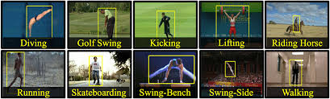

# Activity-Recognition-From-Video

[Original Paper](https://arxiv.org/pdf/1411.4389.pdf)  

The original data used for training by the paper can be found [here](https://drive.google.com/folderview?id=0B_U4GvmpCOecMVIwS1lkSm5KTGM&usp=sharing)  

The videos are taken from UCF-101 dataset. In this implementation I have focused on recognizing 7 activities from  

The base model used for all the codes is VGG-16. First a classification model is trained on the dataset to only classify individual images without any temporal information. This model checkpoint is then used to initialize a LRCN model which takes into account temporal information from the frames.  

Some sample images from the dataset are shown below:  

  

## Keras
The Keras_V1 code uses the traditional numpy arrays and model.fit() function for training. Though it achieves similar performance, the fit() method does not allow to use parallel processing for loading the data. To run the code: extract the downloaded zip file into the Keras_V1/data folder.

The Keras_V2 utilizes the model.fit_generator() functionality which is capable of using parallel processing for data loading and pre-processing. It also allowed me to train on larger dataset as the script loads the data in the memory batch-wise. Use the data provided in the following [link](https://www.dropbox.com/s/rxyr2303tknm4ty/data.tar.gz?dl=0) as the training data which has been split into train, val and test set. Extract the data from the given link into the data/ folder of the main repository. This data will also be used by the PyTorch implementation. 

## PyTorch
The classification model is made end-to-end trainable.  
The convolutional model is used to extract features from an image. Since I was unble to download the models directly from my HPC cluster, I have saved the convolutional part of the pretrained models from torchvision and resored it later in the code. The pretrained models can be downloaded from [here](https://www.dropbox.com/s/wmf2wc65ilblljx/pretrained.zip?dl=0). Extract the contents of the downloaded folder into the pretrained/ directory.  

## Results

## References
*https://github.com/eriklindernoren/Action-Recognition

